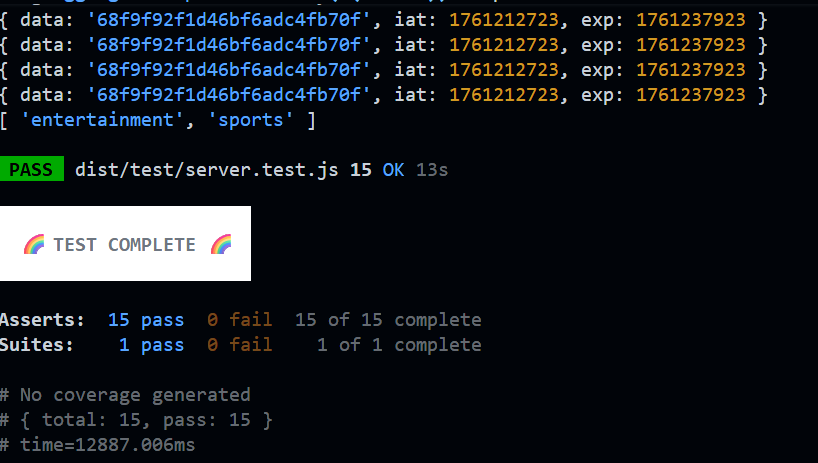

<!--  -->
### NEWS API AGGREGATOR:
Tech stack :
---
Javscript , TypeScript , mongoDB ,Mongoosh , zod (runtime validations);

---
## Functionality Added :

Register - SignUp with password hash ✅.

login - SignUp with jwt hashed password ✅.

preferences - get and update user preferences. ✅

news - Get the aggregated news from external api ✅

Input validation and Error handling using zod and middlewares✅.


## Optionals:

- Added the Global chache for avoid getting api mainy times ✅.

- Added the post and get for mark read news ✅.

- Added the post and get for Favourites news ✅.

- Search using the Keyword ✅ .

Note : The chache was Add in global reflect for all users.

<!-- set up -->

### SETUP:

- STEP -1 : Clone the repo url
- STEP -2 : Install Dependencies

``` 
cd news-aggregator-api-Techharik
```
```
npm i 
```
 
 Dist file is always there  for test dir because test is js folder.

 - STEP -3 : Build the file 

 ```
 npm build
 ```

- STEP - 4: env file has to added with

- Check the env.local file for adding env.

- add mongodb url and external api key.

```
npm run start
```
start the file from dist folder .

```
npm run test
```
for Testing.
```
Make sure to delete the data entry if you are running test again beacuse the mock data will added to the actuall db and throw error second time because email is unique
```




<a href="https://www.veed.io/view/236d69fa-ee89-4a5a-8933-1a741af56376?panel=share">Click Here to see the Video How all the code works  👆👆</a>

